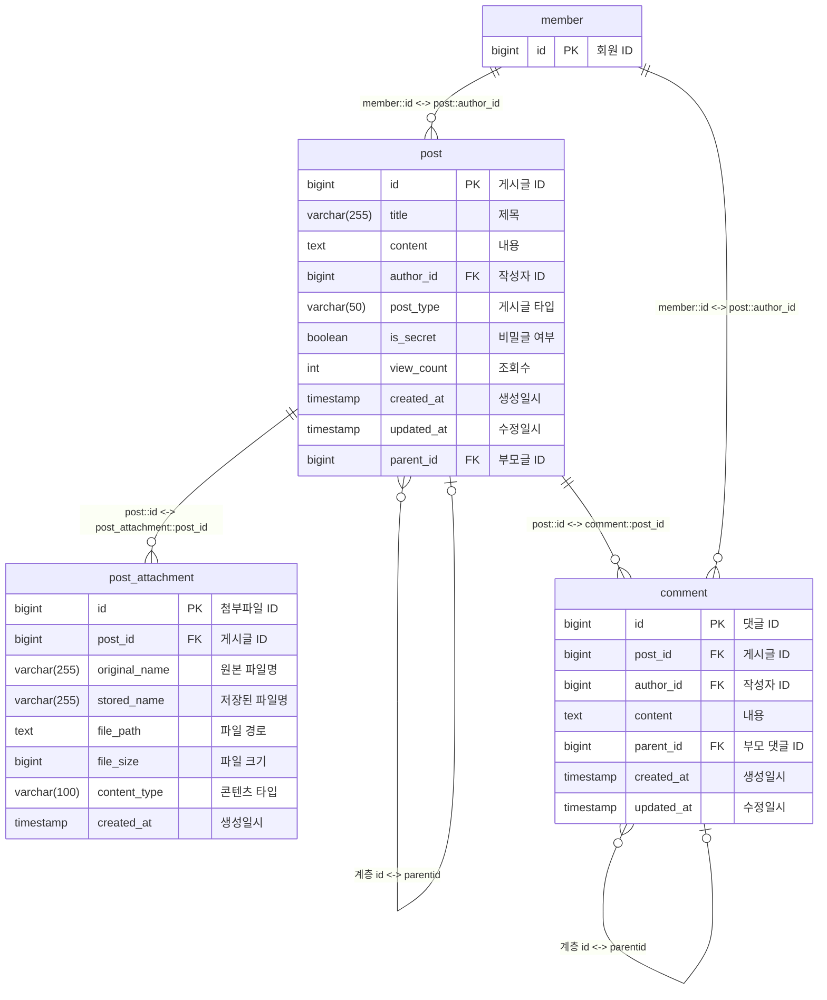

```mermaid
erDiagram
    member {
        bigint id PK "회원 ID"
    }

    post {
        bigint id PK "게시글 ID"
        varchar(255) title "제목"
        text content "내용"
        bigint author_id FK "작성자 ID"
        varchar(50) post_type "게시글 타입"
        boolean is_secret "비밀글 여부"
        int view_count "조회수"
        timestamp created_at "생성일시"
        timestamp updated_at "수정일시"
        bigint parent_id FK "부모글 ID"
    }


    post_attachment {
        bigint id PK "첨부파일 ID"
        bigint post_id FK "게시글 ID"
        varchar(255) original_name "원본 파일명"
        varchar(255) stored_name "저장된 파일명"
        text file_path "파일 경로"
        bigint file_size "파일 크기"
        varchar(100) content_type "콘텐츠 타입"
        timestamp created_at "생성일시"
    }

    comment {
        bigint id PK "댓글 ID"
        bigint post_id FK "게시글 ID"
        bigint author_id FK "작성자 ID"
        text content "내용"
        bigint parent_id FK "부모 댓글 ID"
        timestamp created_at "생성일시"
        timestamp updated_at "수정일시"
    }

    member ||--o{ post : "member::id <-> post::author_id"
    post ||--o{ comment : "post::id <-> comment::post_id"
    member ||--o{ comment : "member::id <-> post::author_id"
    post ||--o{ post_attachment : "post::id <-> post_attachment::post_id"
    post }o--o| post : "계층 id <-> parentid"
    comment }o--o| comment : "계층 id <-> parentid"
```
